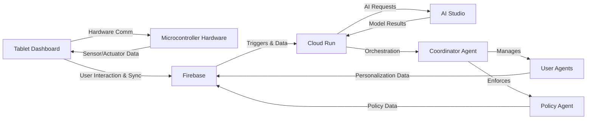
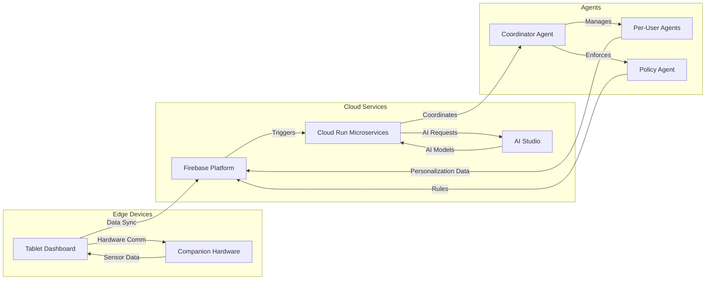

# Staccato System Architecture

## Overview

Staccato employs a multi-agent architecture designed to provide adaptive, personalized family experiences. The system consists of:

- **Per-User Agents**: Individual AI agents managing user-specific data, preferences, and interactions to personalize tasks, schedules, and recommendations.
- **Coordinator Agent**: Orchestrates interactions among per-user agents, resolves conflicts, and manages shared family resources and schedules.
- **Policy Agent**: Enforces family policies, parental controls, and privacy settings, ensuring secure and appropriate interactions.

This architecture enables modular, extensible, and privacy-conscious AI-driven family management.

## Cloud and Edge Architecture

Staccato integrates cloud services and edge computing to balance performance, privacy, and responsiveness:

- **Firebase Platform**: Provides real-time database (Firestore), authentication, storage, and cloud functions for backend data management and synchronization.
- **Cloud Run**: Hosts scalable microservices supporting AI coordination, policy enforcement, and complex logic beyond Firebase functions.
- **AI Studio**: Powers AI personalization and adaptive user experience through machine learning models trained on family interaction data.
- **Companion Hardware**: Optional microcontroller-based devices interfaced with the tablet dashboard to enable physical interactions, environmental sensing, and offline capabilities.

## Communication Flow

- The **Tablet Dashboard** serves as the primary user interface, communicating with both cloud services and companion hardware.
- The **Microcontroller Hardware** connects via Bluetooth or USB, providing sensors and actuators for enhanced interaction (e.g., presence detection, ambient adjustments).
- Cloud services synchronize data and AI models, while edge devices handle real-time sensing and local processing to reduce latency and preserve privacy.
- The **Coordinator Agent** mediates data flow between per-user agents, hardware inputs, and cloud AI services, ensuring seamless and adaptive family experiences.

## AI Personalization and Adaptive User Experience

AI agents learn from user behavior, preferences, and environmental context to:

- Personalize task assignments and reminders.
- Adapt schedules dynamically based on family routines.
- Provide tailored educational content and entertainment.
- Enforce parental controls intelligently.
- Suggest rewards and incentives aligned with family goals.

This continuous learning loop enhances engagement and simplifies family management.

## Diagram

## Privacy, Modularity, and Extensibility

- **Privacy**: Family data is secured with strict access controls and local processing where possible to minimize cloud exposure.
- **Modularity**: Agents and services are decoupled, enabling independent updates and scalability.
- **Extensibility**: New agents, hardware modules, and AI capabilities can be integrated without disrupting existing functionality.

This architecture ensures Staccato remains flexible, secure, and future-proof for evolving family needs.